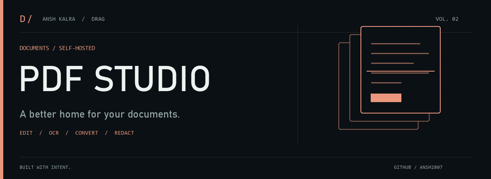

<picture>
  <source media="(prefers-reduced-motion: reduce)" srcset="assets/brand/cover.png">
  
</picture>

# PDF Studio

**Your document toolkit, on your infrastructure.** Edit, OCR, convert, compress, and redact PDFs with a browser interface and a self-hosted processing engine.

[Quick start](#run-it) · [Deployment](DEPLOY.md) · [Architecture](#how-its-built) · [Capabilities](#what-it-does)

<sub>React · Vite · Python · PyMuPDF · Docker</sub>

---

## What it does

The interface is themed as **"Paper Studio"** — a warm kraft-paper desk with a floating cream sheet that unfolds from a tossed paper ball on first load. Behind that calm surface is a serious engine: heavy, professional-grade operations run **server-side in one Docker container** (LibreOffice + Chromium + Python), so visitors can use the tools from a browser. Optional AI summarization can send document text to the provider you configure.

| | | |
|---|---|---|
|  **Edit** text, shapes, notes, redactions |  **OCR** in 27 languages (PP-OCRv4 → Tesseract) |  **Compress** — content-aware, 4 levels |
|  **Convert** to/from Word, Excel, PowerPoint, images |  **Unlock / protect** with real AES-256 (pikepdf) |  **Repair** damaged PDFs |
|  **Merge · split · reorder · rotate** pages |  **Photo Studio** — crop, resize, watermark, bg-removal |  **Recover PDF passwords** (PIN / dictionary / brute-force) |
|  **True redaction** — content removed, not just covered |  **PDF/A** archival export |  **AI summarize** (bring your own key) |

Every tool has a **browser fallback** and a **professional-engine** path — the app shows you which one is running, and degrades gracefully when the engine is off.

## Run it

Install once, then run the app **and** the engine together:

```bash
npm install
npm run dev:full
```

Open **http://127.0.0.1:5173**. Prefer two terminals?

```bash
npm run engine              # the Python/Node professional engine
npm run dev -- --port 5173  # the Vite front-end
```

## Deploy

One container serves the built front-end **and** the engine. Full walkthrough in **[DEPLOY.md](DEPLOY.md)** — point a domain at a small VPS, `docker compose up -d --build`, and Caddy fetches HTTPS automatically.

```bash
cp .env.example .env        # set SITE_ADDRESS=pdf.yourdomain.com
docker compose up -d --build
```

## How it's built

```
React + Vite (src/App.jsx)  ─────────────┐
                                          │  same-origin /api/native/*
  engine-server.cjs  ◀── Node HTTP bridge ┘
        │  spawns per request
        ▼
  engine.py  ── PyMuPDF · pikepdf · pdf2docx · RapidOCR (ONNX) · Tesseract · qpdf
  + LibreOffice (Office→PDF)  + Chromium (HTML→PDF)
```

- **Front-end:** React 19 + Vite 7, pdf.js for rendering, pdf-lib for in-browser edits.
- **Engine:** a single Python CLI (`engine.py`) the Node bridge shells out to — every command reads real files and prints a one-line JSON status. Optional libraries degrade gracefully instead of crashing.
- **Privacy:** uploads are processed in a temp folder and deleted immediately after each request; nothing is stored.

## Notes

- Large OCR/background-removal ONNX model weights (~366 MB) are **not** committed here — they live in `engine/models/` locally. See `requirements.txt` and `DEPLOY.md` for the runtime setup that provides them.
- `.env` is git-ignored; only `.env.example` (placeholders) ships.

---

**Built by [Ansh Kalra / DRAG](https://github.com/ansh2807).** Explore the [project collection](https://github.com/ansh2807#selected-work).

<sub>[View the still cover](assets/brand/cover.png) · [Artwork source](https://github.com/ansh2807/ansh2807/blob/main/tools/generate_brand.py)</sub>
